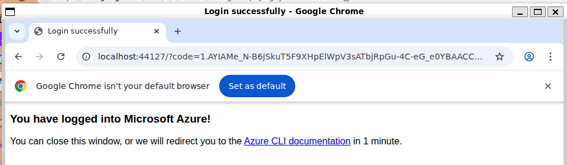

# Azure Storage Deployment with ARM & BICEP: Step-by-Step Guide

> ⭐️ **Enjoying this project?**
>
> If you find this guide helpful, please **star** ⭐️ the repo and **follow** for more practical Azure and DevOps tutorials!
>
> 🔔 Stay tuned for new templates, automation guides, and best practices.
>
> 💬 Have feedback or want to see a specific resource? [Open an issue](../../issues) or connect with me on [LinkedIn](https://www.linkedin.com/in/mehdi-khoder/)!

---

## Table of Contents

- [Azure Storage Deployment with ARM \& BICEP: Step-by-Step Guide](#azure-storage-deployment-with-arm--bicep-step-by-step-guide)
  - [Table of Contents](#table-of-contents)
  - [Learning Goals](#learning-goals)
  - [Introduction: What Are We Building?](#introduction-what-are-we-building)
    - [What is an Azure Storage Account?](#what-is-an-azure-storage-account)
    - [Why use ARM Templates instead of the Azure Portal?](#why-use-arm-templates-instead-of-the-azure-portal)
    - [What are ARM and Bicep?](#what-are-arm-and-bicep)
  - [Prerequisites](#prerequisites)
    - [Test Azure CLI Login and Subscription](#test-azure-cli-login-and-subscription)
  - [Step 1: Set Up Your Environment](#step-1-set-up-your-environment)
  - [Step 2: ARM Deployment](#step-2-arm-deployment)
    - [2.1 Review the ARM Template](#21-review-the-arm-template)
    - [2.2 Create a Parameter File](#22-create-a-parameter-file)
    - [2.3 Deploy the ARM Template with Parameters](#23-deploy-the-arm-template-with-parameters)
      - [2.3.1 Check if the Resource Group exists](#231-check-if-the-resource-group-exists)
      - [2.3.2 Check if the storage account name is available](#232-check-if-the-storage-account-name-is-available)
      - [2.3.3 Deploy the ARM template](#233-deploy-the-arm-template)
  - [Step 3: Bicep Deployment](#step-3-bicep-deployment)
    - [3.1 Review the Bicep Template](#31-review-the-bicep-template)
    - [3.2 Customize the Bicep Deployment Parameters (Compare with ARM)](#32-customize-the-bicep-deployment-parameters-compare-with-arm)
  - [Step 7: Continuous Deployment with GitHub Actions](#step-7-continuous-deployment-with-github-actions)
    - [7.1 Configuring GitHub Actions for Azure Infrastructure as Code](#71-configuring-github-actions-for-azure-infrastructure-as-code)
    - [7.2 Validating Your Deployment Pipeline: End-to-End Testing](#72-validating-your-deployment-pipeline-end-to-end-testing)
  - [Glossary](#glossary)
  - [Summary \& Next Steps](#summary--next-steps)

## Learning Goals

- Understand what an Azure Storage Account is and its use cases
- Learn what ARM and Bicep templates are, and why both are important
- Learn how to deploy resources using ARM templates and Bicep
- Practice using the Azure CLI
- Automate deployments with GitHub Actions
- Document and verify your work

---

## Introduction: What Are We Building?

If you’re new to Azure or cloud infrastructure, let’s start with the basics:

### What is an Azure Storage Account?

An Azure Storage Account is a secure, scalable, and highly available cloud storage solution provided by Microsoft Azure. It allows you to store files, images, videos, logs, backups, and more. You can use it for hosting static websites, supporting big data analytics, or simply storing application data.

### Why use ARM Templates instead of the Azure Portal?

You can create resources like **storage accounts** manually in the Azure Portal, but ARM templates offer important advantages:

- **Repeatable and consistent:** Every deployment is the same—no missed steps or manual errors.
- **Automation:** Easily deploy to dev, test, and prod environments, or set up many resources at once.
- **Version control:** Store your templates in Git to track changes and collaborate with others.
- **Speed:** Deploy complex setups much faster than clicking through the Portal.
- **Scalability:** Great for teams, automation, and large projects.

> The Portal is great for quick, one-off tasks. ARM templates are best for automation, reliability, and working at scale.

### What are ARM and Bicep?

- **ARM (Azure Resource Manager) Template:** A JSON file that describes the resources you want to deploy in Azure. It’s a way to automate and standardize your cloud infrastructure.
- **Bicep:** A newer, more user-friendly language for defining Azure resources. Bicep compiles down to ARM JSON, but is easier to read and write.

> **Note:** Learning ARM first gives you a strong foundation, as Bicep ultimately uses ARM under the hood. This course will guide you through ARM deployment before introducing Bicep, so you understand both the fundamentals and the modern approach.

**Why use both?**

- ARM is the traditional, widely supported format.
- Bicep is the modern, recommended approach for new projects.
- Learning both helps you understand Azure infrastructure as code, and gives you flexibility for any project.

---

## Prerequisites

- **Azure Subscription**: You need an active Azure subscription to deploy resources and to log in with the Azure CLI.

  1. First, check if you already have a subscription by visiting the [Azure Subscriptions page](https://portal.azure.com/#view/Microsoft_Azure_Billing/SubscriptionsBlade). This will show all subscriptions associated with your account.
      > 

  2. If you don't have one, you can create a free account at [https://azure.com/free](https://azure.com/free)
      > 

  3. If you already have an Azure account but no subscription, you can add a new subscription here: [Add Subscription](https://portal.azure.com/#view/Microsoft_Azure_Billing/CatalogBlade/appId/AddSubscriptionButton).
     > 

- **Azure CLI**: You need the Azure CLI installed. You can install it by following the official instructions:

  <https://learn.microsoft.com/en-us/cli/azure/install-azure-cli>

  Or on Linux (WSL2 Ubuntu, for me), run:

  ```bash
  curl -sL https://aka.ms/InstallAzureCLIDeb | sudo bash
  ```

### Test Azure CLI Login and Subscription

After installing the Azure CLI, log in and verify your subscription:

This command opens a web browser for you to log in to your Azure account.

```bash
az login
```


You should see your default browser open with a login page.


Multifactor authentication (MFA) may be required, depending on your organization's security policies. Follow the prompts to complete the login process.


After logging in, you will see a confirmation message in the browser and the terminal.



After logging in, you can check your subscriptions with:

```bash
az account list --output table
```


If you have multiple subscriptions, set the correct one:

```bash
az account set --subscription "<subscription-name-or-id>"
```

> **You’re ready to start!**
> Now that you have an **Azure subscription** and the **Azure CLI** installed and tested, you have everything you need to set up your environment and begin deploying resources with ARM or Bicep templates.

---

## Step 1: Set Up Your Environment

1. Ensure you have completed the prerequisites above.
2. Open a terminal and navigate to this project directory.

---

## Step 2: ARM Deployment

### 2.1 Review the ARM Template

- **File:** `templates/storage-arm.json`

The ARM template is a JSON file that describes the Azure resources you want to deploy. Here’s what each part means:

- `$schema`: Specifies the location of the JSON schema file that describes the version of the template language.
- `contentVersion`: The version of your template (you can use `1.0.0.0`).
- `parameters`: Defines values you can pass in at deployment time (e.g., storage account name).
- `resources`: An array of resources to deploy. In this case, it defines a storage account with:
  - `type`: The Azure resource type (here, a storage account).
  - `apiVersion`: The API version to use for the resource.
  - `name`: The name of the storage account, set using a parameter.
  - `location`: The Azure region for deployment.
  - `sku`: The SKU (pricing tier) for the storage account.
  - `kind`: The type of storage account (e.g., `StorageV2`).
  - `properties`: Additional settings (empty here, but can be used for advanced configuration).

### 2.2 Create a Parameter File

> **Why use a parameter file?**  
> Parameter files let you keep your template code reusable and clean. Instead of hardcoding values (like the storage account name) in your main template, you provide them separately for each environment (dev, prod, etc.). This makes it easy to deploy the same template with different settings.

- Copy the provided template file `dev.parameters.json.default` in the `templates` folder and rename it to `dev.parameters.json` (or `prod.parameters.json` for production). Then customize the file for your environment.

```json
{
  "$schema": "https://schema.management.azure.com/schemas/2019-04-01/deploymentParameters.json#",
  "parameters": {
    "storageAccountName": {
      "value": "devstor<your-unique>"
    ```
    }
    ```
  }
}
```

> **Note:** The value you set here (e.g., `devstor<your-unique>`) must match the parameter used in your ARM template. Make sure the parameter name and value are consistent between your parameter file and the template for a successful deployment.
>
> **Tip:** Follow Microsoft naming best practices: use only lowercase letters and numbers, start with a prefix like `dev` or `prod`, keep it 3–24 characters, and make it globally unique (e.g., `devstor12345`).


### 2.3 Deploy the ARM Template with Parameters

> **Pro Tip:** Type commands yourself—don’t just copy-paste. It’s the fastest way to learn!

**Before you start:**

- Make sure you have your parameter file ready (e.g., `dev.parameters.json`).
- Decide on your resource group name (e.g., `devops-rg`).
  > **Tip:** Resource group names follow Microsoft best practices: use letters, numbers, underscores, parentheses, hyphens, and periods, up to 90 chars. Pick something clear (e.g., `devops-rg`).
- Pick an Azure region (location) for your resources (e.g., `westeurope`, `eastus`). To see all regions, run:

    ```bash
    az account list-locations -o table
    ```

    > **Filter by country/area:**
    > - Windows PowerShell:
    >
    >     ```powershell
    >     az account list-locations -o table | Where-Object { $_.ReadCount -eq 1 -or $_ -match "uk" }
    >     ```
    >
    > - Windows CMD:
    >
    >     ```cmd
    >     az account list-locations -o table | findstr /i "DisplayName uk"
    >     ```
    >
    > - Linux/macOS:
    >
    >     ```bash
    >     az account list-locations -o table | awk 'NR==1 || /[Uu][Kk]/'
    >     ```
    >
    >     This will show the header and all rows containing 'uk' (case-insensitive) in any part of the row.
    >
    >     **How to pick the right Azure region:**
    >     Azure regions are named by area, not city (e.g., `uksouth` = London, `ukwest` = Cardiff, `eastus` = Virginia, `uaenorth` = Dubai). There is no region for every city—choose the closest available region to your location or users.
    >
    >     Example mappings:
    >
    >   - **UK:**
    >     - London → `uksouth`
    >     - Cardiff → `ukwest`
    >   - **US:**
    >     - East Coast (e.g., NYC, Miami) → `eastus`, `eastus2`
    >     - West Coast (e.g., LA, Seattle) → `westus`, `westus2`
    >   - **UAE:**
    >     - Dubai → `uaenorth`
    >     - Abu Dhabi → `uaecentral`
    >
    >   **Tip:** For a full list and map, 
    >   see: <https://azure.microsoft.com/en-us/explore/global-infrastructure/geographies/>

    Now you’re ready to deploy:

#### 2.3.1 Check if the Resource Group exists

   ```bash
   az group show --name devops-rg
   ```

   If it does not exist, create it:

   

   ```bash
   az group create --name devops-rg --location uksouth
   ```

   > 
   >
   > Check again in Azure Portal:
   >
   > 

#### 2.3.2 Check if the storage account name is available

   > **Why check first?**
   > Storage account names must be unique across all of Azure. If you pick a name that's already taken, your deployment will fail. Checking first helps you avoid errors and prevents you from overwriting someone else's storage account.
   >
   > **How to check:**
   >
   > - Use the Azure CLI to list all storage account names in your subscription:
   >
   >   ```bash
   >   az storage account list --query "[].name" -o table
   >   ```
   >
   >   If your desired name is not in the list, it is likely available.
   >
   >   You can also check in the [Azure Portal](https://portal.azure.com/#browse/resourcegroups) by searching for your storage account name.

   Now proceed with the deployment.

#### 2.3.3 Deploy the ARM template

   ```bash
   az deployment group create -g devops-rg -f templates/storage-arm.json -p @templates/dev.parameters.json
   ```
  
  > You can use either the short or long form in Azure CLI commands; both work the same way:
  >
  > - `-g`: Short for `--resource-group` (the Azure resource group to deploy into)
  > - `-f`: Short for `--template-file` (the path to your ARM template)
  > - `-p`: Short for `--parameters` (the parameter file with your custom values)
  >
  > **Tips**:
  > If you don't want to experiment the same result when you use a common name such as "devstor1" across Azure:
  >
  > ```bash
  > {"status":"Failed","error":{"code":"DeploymentFailed","target":"/subscriptions/b6891ac3-2708-4726-b31b-cfef1a90c30c/resourceGroups/devops-rg/providers/Microsoft.Resources/deployments/storage-arm","message":"At least one resource deployment operation failed. Please list deployment operations for details. Please see https://aka.ms/arm-deployment-operations for usage details.","details":[{"code":"StorageAccountAlreadyTaken","message":"The storage account named devstor1 is already taken."}]}}
  > ```
  >
  > This is a success ouput:  
  >
  > 
  >
  > In Azure Portal, you can see the storage account recently created in your resource group:
  >
  > 

---

## Step 3: Bicep Deployment

### 3.1 Review the Bicep Template

- **File:** `templates/storage-bicep.bicep`

The Bicep template is a more concise, user-friendly file for defining Azure resources. It describes the same storage account as the ARM template, but with simpler syntax.

### 3.2 Customize the Bicep Deployment Parameters (Compare with ARM)

In this step, you'll deploy a second storage account using a new Bicep parameter file.

1. **Edit your parameter file to include the Bicep parameter**
   - Create `templates/dev.parameters.bicep.json` with the following content:

   ```json
   {
     "$schema": "https://schema.management.azure.com/schemas/2019-04-01/deploymentParameters.json#",
     "parameters": {
       "secondStorageAccountName": {
         "value": "devstor1bicep"
       }
     }
   }
   ```
  
   - This file is used only for the Bicep deployment and matches the parameter name in your Bicep template (`secondStorageAccountName`).

2. **Check name availability**
   - Before deploying, check that your new storage account name is available using the same logic as in the ARM section:

   - List all storage account names in your subscription:

   ```bash
   az storage account list --query "[].name" -o table
   ```

   - If your desired name (e.g., `devstor1bicep`) is not in the list, it is likely available.
   - You can also check in the [Azure Portal](https://portal.azure.com/#browse/resourcegroups) by searching for your storage account name.

3. **Deploy the Bicep template**

   - The Bicep template should define:

   ```bicep
   param secondStorageAccountName string

   resource stg 'Microsoft.Storage/storageAccounts@2021-02-01' = {
     name: secondStorageAccountName
     location: resourceGroup().location
     sku: {
       name: 'Standard_LRS'
     }
     kind: 'StorageV2'
     properties: {}
   }
   ```

   - Run the following command to deploy the storage account using Bicep and your parameter file:

   ```bash
   az deployment group create -g devops-rg -f templates/storage-bicep.bicep -p @templates/dev.parameters.bicep.json
   ```

   


4. **Verify in Azure Portal**
   - Go to the [Azure Storage Account](https://portal.azure.com/#browse/Microsoft.Storage%2FStorageAccounts), open your resource group (e.g., `devops-rg`), and confirm that both storage accounts (the one deployed by ARM and the one deployed by Bicep) are listed.

   

## Step 7: Continuous Deployment with GitHub Actions

### 7.1 Configuring GitHub Actions for Azure Infrastructure as Code

This project includes a sample GitHub Actions workflow in `.github/workflows/deploy.yml` to automate deployment on push.

**Sample `deploy.yml` content (deploys both ARM and Bicep templates):**

```yaml
name: Deploy Azure Storage
on: [push]
jobs:
  deploy:
    runs-on: ubuntu-latest
    steps:
    - uses: actions/checkout@v2
    - name: Azure Login
      uses: azure/login@v1
      with:
        creds: ${{ secrets.AZURE_CREDENTIALS }}
        # Make sure AZURE_CREDENTIALS is set in your repository secrets:
        # GitHub > Settings > Secrets and variables > Actions > New repository secret > Name: AZURE_CREDENTIALS
    - name: Deploy ARM Template
      run: az deployment group create -g devops-rg -f templates/storage-arm.json -p @templates/dev.parameters.json
    - name: Deploy Bicep Template
      run: az deployment group create -g devops-rg -f templates/storage-bicep.bicep -p @templates/dev.parameters.bicep.json
```

**Workflow Explanation:**

- `on: [push]`: Triggers the workflow on every push to the repository.
- `runs-on: ubuntu-latest`: Uses the latest Ubuntu GitHub-hosted runner.
- `actions/checkout@v2`: Checks out your repository code for the workflow.
- `azure/login@v1`: Authenticates to Azure using credentials stored in your repository secrets (`AZURE_CREDENTIALS`).
- `creds: ${{ secrets.AZURE_CREDENTIALS }}`: Uses the secret you set up in your repo for secure Azure authentication.
- `Deploy ARM Template`: Deploys the ARM template using its parameter file.
- `Deploy Bicep Template`: Deploys the Bicep template using its parameter file.

**Best Practice Tips:**

- Ensure your resource group (`devops-rg`) exists before running the workflow, or update the name to match your environment. If you delete the resource group for testing, you must recreate it before GitHub Actions can deploy resources.
- The `AZURE_CREDENTIALS` secret must be set up in your GitHub repository for authentication. You can generate it using the Azure CLI and add it in your repo settings under Secrets.
- Both templates will be deployed on every push, ensuring your infrastructure is always up to date and consistent.

**How to Create the `AZURE_CREDENTIALS` Secret for Secure Automation:**

To enable GitHub Actions to deploy to Azure, you need to create a Service Principal and generate credentials. Here’s how:

1. **Log in to Azure CLI:**

   ```bash
   az login
   ```

2. **Create a Service Principal and output credentials to a file:**
   Replace `<YOUR-GITHUB-USERNAME>` with your GitHub username (or any unique name).

   ```bash
   az ad sp create-for-rbac --name "github-actions-<YOUR-GITHUB-USERNAME>" --role contributor --scopes /subscriptions/<SUBSCRIPTION_ID> --sdk-auth > azure-credentials.json
   ```

   - Find your subscription ID with:

     ```bash
     az account show --query id -o tsv
     ```

   - The command will create a file called `azure-credentials.json` with the required JSON.
     

3. **Copy the contents of `azure-credentials.json`.**

4. **Add as a GitHub secret:**
   - Go to the GitHub repository of your current project > Settings > Secrets and variables > Actions > New repository secret.
   - Name: `AZURE_CREDENTIALS`
   - Value: Paste the entire JSON content from `azure-credentials.json`.
   - Save.

  

> **Security Tip:** Never share your credentials file. Delete the local file after adding it to GitHub.

---

### 7.2 Validating Your Deployment Pipeline: End-to-End Testing

Follow these steps to test your GitHub Actions deployment pipeline:

1. **Delete the storage accounts you created manually** (using ARM and Bicep) so GitHub Actions can recreate them automatically:

   ```bash
   az storage account delete -n devmmikstor1 -g devops-rg
   az storage account delete -n devstor1bicep -g devops-rg
   ```

   Or, to delete the entire resource group (removes all resources in it):

   ```bash
   az group delete -n devops-rg
   ```

   > **Warning:** Deleting the resource group will remove all resources inside it. Use with caution. If you delete the resource group, you must recreate it (with the same name) before the workflow can deploy resources again:
   >
   > ```bash
   > az group create --name devops-rg --location <your-region>
   > ```

2. **Push a commit to your repository** (or trigger the workflow as configured). This will start the GitHub Actions workflow.

3. **GitHub Actions will automatically redeploy all resources** as defined in your ARM and Bicep templates and parameter files.

4. **Verify in the Azure Portal** that your storage accounts and other resources have been recreated by the workflow.

> **Pro Tip:** This is a safe way to test your automation. By deleting the resources and letting GitHub Actions recreate them, you can confirm that your infrastructure-as-code setup works end-to-end.

---

## Glossary

- **Resource**: Any manageable item available through Azure, such as a virtual machine, storage account, or database.
- **Resource Group**: A container that holds related Azure resources. It helps organize and manage resources as a unit.
- **ARM Template**: A JSON file that defines the infrastructure and configuration for your Azure solution.
- **Bicep**: A domain-specific language (DSL) for deploying Azure resources declaratively, offering a simpler syntax than ARM JSON.
- **Azure CLI**: A command-line tool to manage Azure resources from your terminal or scripts.
- **Subscription**: An Azure subscription is an agreement with Microsoft to use Azure services, and it provides access to resources and billing.
- **Deployment**: The process of creating or updating resources in Azure using templates or scripts.

---

## Summary & Next Steps

- You have learned how to deploy an Azure Storage Account using both ARM and Bicep.
- You practiced using the Azure CLI and optionally automated the process.
- For more, explore Azure documentation or try adding parameters to the templates for customization.

---

_Thank you for using this guide! If you found it helpful, please consider giving the project a ⭐️ or following for more professional Azure & DevOps resources.  
Questions or suggestions? [Open an issue](../../issues) or connect with me on [LinkedIn](https://www.linkedin.com/in/mehdi-khoder/)._
